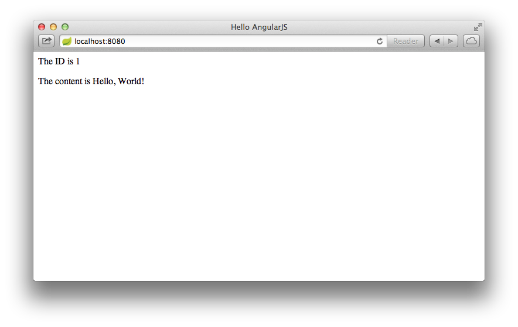

This guide walks you through writing a simple AngularJS client that consumes a Spring MVC-based [RESTful web service][u-rest].

What you'll build
-----------------

You'll build an AngularJS client that consumes a Spring-based RESTful web service.
Specifically, the client will consume the service created in [Building a RESTful Web Servce][gs-rest-service].

The AngularJS client will be accessed at:

	http://localhost:8080/

and will consume the service accepting requests at:

    http://localhost:8080/greeting

The service will respond with a [JSON][u-json] representation of a greeting:

```json
{"id":1,"content":"Hello, World!"}
```

The client will render the ID and content into the DOM.

What you'll need
----------------

 - About 15 minutes
 - A favorite text editor or IDE
 - [JDK 6][jdk] or later
 - [Gradle 1.8+][gradle] or [Maven 3.0+][mvn]
 - You can also import the code from this guide as well as view the web page directly into [Spring Tool Suite (STS)][gs-sts] and work your way through it from there.

[jdk]: http://www.oracle.com/technetwork/java/javase/downloads/index.html
[gradle]: http://www.gradle.org/
[mvn]: http://maven.apache.org/download.cgi
[gs-sts]: /guides/gs/sts


How to complete this guide
--------------------------

Like all Spring's [Getting Started guides](/guides/gs), you can start from scratch and complete each step, or you can bypass basic setup steps that are already familiar to you. Either way, you end up with working code.

To **start from scratch**, move on to [Set up the project](#scratch).

To **skip the basics**, do the following:

 - [Download][zip] and unzip the source repository for this guide, or clone it using [Git][u-git]:
`git clone https://github.com/spring-guides/gs-consuming-rest-angularjs.git`
 - cd into `gs-consuming-rest-angularjs/initial`.
 - Jump ahead to [Create an AngularJS Controller](#initial).

**When you're finished**, you can check your results against the code in `gs-consuming-rest-angularjs/complete`.
[zip]: https://github.com/spring-guides/gs-consuming-rest-angularjs/archive/master.zip
[u-git]: /understanding/Git


<a name="scratch"></a>
Set up the project
------------------

First you set up a basic build script. You can use any build system you like when building apps with Spring, but the code you need to work with [Gradle](http://gradle.org) and [Maven](https://maven.apache.org) is included here. If you're not familiar with either, refer to [Building Java Projects with Gradle](/guides/gs/gradle/) or [Building Java Projects with Maven](/guides/gs/maven).

### Create the directory structure

In a project directory of your choosing, create the following subdirectory structure; for example, with `mkdir -p src/main/java/hello` on *nix systems:

    └── src
        └── main
            └── java
                └── hello


### Create a Gradle build file
Below is the [initial Gradle build file](https://github.com/spring-guides/gs-consuming-rest-angularjs/blob/master/initial/build.gradle). But you can also use Maven. The pom.xml file is included [right here](https://github.com/spring-guides/gs-consuming-rest-angularjs/blob/master/initial/pom.xml). If you are using [Spring Tool Suite (STS)][gs-sts], you can import the guide directly.

`build.gradle`
```gradle
buildscript {
    repositories {
        maven { url "http://repo.spring.io/libs-snapshot" }
        mavenLocal()
    }
    dependencies {
        classpath("org.springframework.boot:spring-boot-gradle-plugin:0.5.0.M4")
    }
}

apply plugin: 'java'
apply plugin: 'eclipse'
apply plugin: 'idea'
apply plugin: 'spring-boot'

jar {
    baseName = 'gs-consuming-rest-angularjs'
    version =  '0.1.0'
}

repositories {
    mavenCentral()
    maven { url "http://repo.spring.io/libs-snapshot" }
}

dependencies {
    compile("org.springframework.boot:spring-boot-starter-web:0.5.0.M4")
    compile("com.fasterxml.jackson.core:jackson-databind")
    testCompile("junit:junit:4.11")
}

task wrapper(type: Wrapper) {
    gradleVersion = '1.8'
}
```
    
[gs-sts]: /guides/gs/sts    

> **Note:** This guide is using [Spring Boot](/guides/gs/spring-boot/).

Create the REST service
-----------------------

Now that you've set up the project and build system, you can create your web service.
Because the primary focus of this guide is to create a client to consume a REST service and not how to create the service itself, this guide will only briefly show you the components necessary to create that service.
For more details regarding the creation of the service, see [Building a RESTful Web Service][gs-rest-service]

The service will need a class to represent the resource being served.

`src/main/java/hello/Greeting.java`
```java
package hello;

public class Greeting {

    private final long id;
    private final String content;

    public Greeting(long id, String content) {
        this.id = id;
        this.content = content;
    }

    public long getId() {
        return id;
    }

    public String getContent() {
        return content;
    }
}
```

It will also need a Spring MVC controller to handle requests and return the greeting resource:

`src/main/java/hello/GreetingController.java`
```java
package hello;

import java.util.concurrent.atomic.AtomicLong;
import org.springframework.web.bind.annotation.RequestMapping;
import org.springframework.web.bind.annotation.RequestParam;
import org.springframework.web.bind.annotation.RestController;

@RestController
public class GreetingController {

    private static final String template = "Hello, %s!";
    private final AtomicLong counter = new AtomicLong();

    @RequestMapping("/greeting")
    public Greeting greeting(
            @RequestParam(value="name", required=false, defaultValue="World") String name) {
        return new Greeting(counter.incrementAndGet(),
                            String.format(template, name));
    }
}
```

<a name="initial"></a>
Create an AngularJS Controller
------------------------------

Now that the service classes are in place, you can create the AngularJS client.
First, you'll create the AngularJS controller module that will consume the REST service: 

`src/main/resources/static/hello.js`
```js
function Hello($scope, $http) {
    $http.get('/greeting').
        success(function(data) {
            $scope.greeting = data;
        });
}
```

This controller module is represented as a simple JavaScript function that is given AngularJS's `$scope` and `$http` components.
It uses the `$http` component to consume the REST service at "/greeting".

If successful, it will assign the JSON returned back from the service to `$scope.greeting`, effectively setting a model object named "greeting".
By setting that model object, AngularJS can bind it to the application page's DOM, rendering it for the user to see.

Create the Application Page
---------------------------

Next, you'll create the HTML page that will load the client into your web browser:

`src/main/resources/static/index.html`
```html
<!doctype html>
<html ng-app>
	<head>
		<title>Hello AngularJS</title>
		<script src="/webjars/angularjs/1.1.5/angular.js"></script>
    	<script src="hello.js"></script>
	</head>

	<body>
		<div ng-controller="Hello">
			<p>The ID is {{greeting.id}}</p>
			<p>The content is {{greeting.content}}</p>
		</div>
	</body>
</html>
```

For the most part, this is a basic HTML file.
But there are a few noteworthy things to draw your attention to.

First, notice that the page loads two script files.
It loads the minified AngularJS library (angular.min.js) from a content delivery network (CDN) so that you don't have to download AngularJS and place it in your project.
It also loads the controller code (hello.js) from the application's path.

The AngularJS library enables several custom attributes for use with standard HTML tags.
In index.html, two such attributes are in play:

 * The `<html>` tag has the `ng-app` attribute to indicate that this page is an AngularJS applications.
 * The `<div>` tag has the `ng-controller` attribute set to reference `Hello`, the controller module.

Finally, with the two `<p>` tags, there are a couple of placeholders identified with double-curly-braces.
These are placeholders reference the `id` and `content` properties of the `greeting` model object which was set upon successfully consuming the REST service.

Make the application executable
-------------------------------

Although it is possible to package this service as a traditional [WAR][u-war] file for deployment to an external application server, the simpler approach demonstrated below creates a standalone application. You package everything in a single, executable JAR file, driven by a good old Java `main()` method. Along the way, you use Spring's support for embedding the [Tomcat][u-tomcat] servlet container as the HTTP runtime, instead of deploying to an external instance.

### Create an Application class

`src/main/java/hello/Application.java`
```java
package hello;

import org.springframework.boot.autoconfigure.EnableAutoConfiguration;
import org.springframework.boot.SpringApplication;
import org.springframework.context.annotation.ComponentScan;

@ComponentScan
@EnableAutoConfiguration
public class Application {

    public static void main(String[] args) {
        SpringApplication.run(Application.class, args);
    }
}
```

The `main()` method defers to the [`SpringApplication`][] helper class, providing `Application.class` as an argument to its `run()` method. This tells Spring to read the annotation metadata from `Application` and to manage it as a component in the [Spring application context][u-application-context].

The `@ComponentScan` annotation tells Spring to search recursively through the `hello` package and its children for classes marked directly or indirectly with Spring's [`@Component`][] annotation. This directive ensures that Spring finds and registers the `GreetingController`, because it is marked with [`@RestController`][], which in turn is a kind of `@Component` annotation.

The [`@EnableAutoConfiguration`][] annotation switches on reasonable default behaviors based on the content of your classpath. For example, because the application depends on the embeddable version of Tomcat (tomcat-embed-core.jar), a Tomcat server is set up and configured with reasonable defaults on your behalf. And because the application also depends on Spring MVC (spring-webmvc.jar), a Spring MVC [`DispatcherServlet`][] is configured and registered for you — no `web.xml` necessary! Auto-configuration is a powerful, flexible mechanism. See the [API documentation][`@EnableAutoConfiguration`] for further details.

The static content of the application, `index.html` and `hello.js` will be served by the embedded Tomcat server because it is in a directory named "static" relative to the root of the classpath.

### Build an executable JAR

Now that your `Application` class is ready, you simply instruct the build system to create a single, executable jar containing everything. This makes it easy to ship, version, and deploy the service as an application throughout the development lifecycle, across different environments, and so forth.

Below are the Gradle steps, but if you are using Maven, you can find the updated pom.xml [right here](https://github.com/spring-guides/gs-consuming-rest-angularjs/blob/master/complete/pom.xml) and build it by typing `mvn clean package`.

Update your Gradle `build.gradle` file's `buildscript` section, so that it looks like this:

```groovy
buildscript {
    repositories {
        maven { url "http://repo.spring.io/libs-snapshot" }
        mavenLocal()
    }
    dependencies {
        classpath("org.springframework.boot:spring-boot-gradle-plugin:0.5.0.M4")
    }
}
```

Further down inside `build.gradle`, add the following to the list of applied plugins:

```groovy
apply plugin: 'spring-boot'
```
You can see the final version of `build.gradle` [right here]((https://github.com/spring-guides/gs-consuming-rest-angularjs/blob/master/complete/build.gradle).

The [Spring Boot gradle plugin][spring-boot-gradle-plugin] collects all the jars on the classpath and builds a single "über-jar", which makes it more convenient to execute and transport your service.
It also searches for the `public static void main()` method to flag as a runnable class.

Now run the following command to produce a single executable JAR file containing all necessary dependency classes and resources:

```sh
$ ./gradlew build
```

If you are using Gradle, you can run the JAR by typing:

```sh
$ java -jar build/libs/gs-consuming-rest-angularjs-0.1.0.jar
```

If you are using Maven, you can run the JAR by typing:

```sh
$ java -jar target/gs-consuming-rest-angularjs-0.1.0.jar
```

[spring-boot-gradle-plugin]: https://github.com/spring-projects/spring-boot/tree/master/spring-boot-tools/spring-boot-gradle-plugin

> **Note:** The procedure above will create a runnable JAR. You can also opt to [build a classic WAR file](/guides/gs/convert-jar-to-war/) instead.

Run the service
-------------------
If you are using Gradle, you can run your service at the command line this way:

```sh
$ ./gradlew clean build && java -jar build/libs/gs-consuming-rest-angularjs-0.1.0.jar
```

> **Note:** If you are using Maven, you can run your service by typing `mvn clean package && java -jar target/gs-consuming-rest-angularjs-0.1.0.jar`.


Logging output is displayed. The application should be up and running within a few seconds.


Test the client
---------------

Now that the application is running is up, visit <http://localhost:8080>, where you see:



The ID value will increment each time you refresh the page.

Summary
-------

Congratulations! You've just developed an AngularJS client that consumes a Spring-based RESTful web service.

[u-rest]: /understanding/REST
[u-json]: /understanding/JSON
[u-view-templates]: /understanding/view-templates
[jackson]: http://wiki.fasterxml.com/JacksonHome
[u-war]: /understanding/WAR
[u-tomcat]: /understanding/Tomcat
[u-application-context]: /understanding/application-context
[`@RestController`]: http://docs.spring.io/spring/docs/current/javadoc-api/org/springframework/web/bind/annotation/RestController.html
[`SpringApplication`]: http://docs.spring.io/spring-boot/docs/0.5.0.M3/api/org/springframework/boot/SpringApplication.html
[`@EnableAutoConfiguration`]: http://docs.spring.io/spring-boot/docs/0.5.0.M3/api/org/springframework/boot/autoconfigure/EnableAutoConfiguration.html
[`@Component`]: http://docs.spring.io/spring/docs/current/javadoc-api/org/springframework/stereotype/Component.html
[`@ResponseBody`]: http://docs.spring.io/spring/docs/current/javadoc-api/org/springframework/web/bind/annotation/ResponseBody.html
[`MappingJackson2HttpMessageConverter`]: http://docs.spring.io/spring/docs/current/javadoc-api/org/springframework/http/converter/json/MappingJackson2HttpMessageConverter.html
[`DispatcherServlet`]: http://docs.spring.io/spring/docs/current/javadoc-api/org/springframework/web/servlet/DispatcherServlet.html
[gs-rest-service]: /guides/gs-rest-service/

